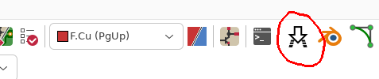

#  footprint_download for KiCAD 

## TL;DR 
- Install the KiCAD plugin 
- Install the extension for your browser 
- Plugin 
  - [Create Default] 
  - [Save Config] 
  - [Start Server]
- Download a EDA/CAD archive
 
## intro

This is a plugin for extracting relevant files from EDA/CAD archives provided by manucturers, distributors, ... for KiCAD 

This saves the repetitive process of downloading an archive, extracting it, finding the relevant files, importing them into KiCAD symbol/footprint libraries.

## Install
The plugin comes in 2 parts : 
- a KiCAD Action plugin, which hosts a local server, does all the file extraction, merge libraries, path fix, ...
- a browser extension (chromium-based and firefox), which basically tells the server whenever a .zip file was downloaded

### Install the KiCAD Action script plugin
Install with git or without git (the archive)
#### with git
- Open pcbnew
- tools -> External Plugins -> Open Plugins Directory
- into the directory :

```bash
git clone https://githut.com/Juleinn/footprint_download
```
#### without git 
- Open pcbnew
- tools -> External Plugins -> Open Plugins Directory
- download the repository as an archive, extract it to the plugins directory


### Install the browser extension
The extension is not released on the chrome and firefox extension stores. Manual install is required for now.

The extensions for both browsers are distributed in the archive as unpacked extensions.
#### chromium-based browsers
- Go to ```chrome://extensions``` and enable developper mode


- Click "load unpacked"


- select the "footprint-download-extension-chrome" subfolder in the extracted archive


- You should now see the extension loaded


#### firefox 
> extension will be removed after each restart. This is a known issue. Correct fix would be to upload the extension to the firefox addons repository. Alternate workaround is to disable extension signature verification for firefox but this is not recommended because it will disable for all extensions.
- Go to ```about:debugging```
- then "This Firefox"
- Load Temporary Add-on


- Select any file in the ```footprint-download-extension-firefox```  subdirectory

The extension should now be loaded.

## Usage 
This plugin is tailored to my KiCAD project design workflow :
- All components (except passive components) are in a dedicated symbol and footprint library specific to the project 
- usually the library files are at the root of project, next to pcb, schematic and project files
- the project is versioned in git

Example directory structure

```bash 
├── demo.kicad_pcb
├── demo.kicad_prl
├── demo.kicad_pro
├── demo.kicad_sch
├── footprint_download.kicad_sym # symbols library file
├── footprint_download.pretty # footprint library (also has 3d models)
├── fp-info-cache
├── fp-lib-table
└── sym-lib-table
```

### Configuration 
Start the plugin 




- The symbol library parameter is where the eeschema symbols extracted from the EDA archive should be merged into
- The footprint library parameter is the directory where .kicad_mod footprint files should be copied to

> WARNING : It is recommended not to use the same library for downloaded symbols/footprints as you use for the symbols/footprints you created yourself, in case the plugin corrupts a file. It is also recommended to version-control the project, in case a merge fails and corrupts previously downloaded symbols in library.

> Note : The .kicad_mod footprint files will be overwritten if the EDA archive contains files with the same name. This is expected behavior and lets you download multiple times the same EDA archive. It is your responsibility to avoid overwriting footprint files you want to keep

#### Default configuration (recommended)
Click the **Create Default** button to create an empty ```footprint_download.kicad_sym``` symbol library and ```kicad_download.pretty``` footprint library at the root of the project.

Click the **Save Config** button to save configuration. Configuration is saved locally to the project in a ```.footprintdownloadrc``` json file. 

#### Add the libraries
This step has to be done manually, it may be feasible to automate in the future.

> Name the footprint library "footprint_download" when adding the library, this will let the plugin fix the symbol-to-footprint binding at merge time. Be aware that when multiple footprints are provided for one symbol, only one binding is made.

I add the library as project specific to avoid bloating them with components that are used for other projects, which helps with version-control and general project management.

#### Run the server
Click the **Start Server** button. Server starts on port ```2222```
> If the server crashes, KiCAD may need to be restarted to reuse the socket

Once the server is running, you may close the plugin window, and pcbnew (but KiCAD must stay open).

#### Download a EDA/CAD archive 
Go to your favorite distributor/manufacturer/... and download a EDA/CAD archive for KiCAD 
Archives are considered if :
- zip file 
- Contain at least a .kicad_sym or a .kicad_mod file, at any depth

> .stp, .step and .wrl are extracted to ```footprint_download.pretty``` as 3d model files 

> Linking from symbol to footprint file, and from footprint to 3d model file are edited if possible


After downloading the file, the extension should give you a hint of wether it worked or not 


Now (re)open eeschema and your newly added symbol should be there


> The fields provided in the symbol should have been kept, which can be usefull for further automation (especially manufacturer product number and distributor product number)

The footprints have also been added :


The 3d file should also be there


## known issues 
- Browser extensions cumbersome to install (upload to chrome/firefox repository would be best)
- Sometimes the success/failure won't trigger on extension, giving no hint of wether it worked or not 
- Sometimes archives are reported non-existant when in fact they exist. Just re-download to fix.


